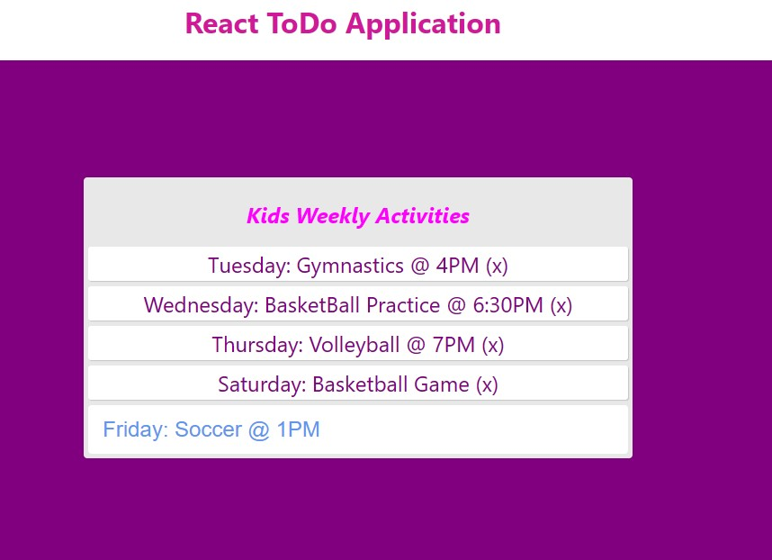

<a href="https://github.com/TennWilliams/React-ToDo-List"> React ToDo List </a>
## Kids Weekly Activity To Do List

I created a styled weekly list application in React detailing my kids activities for the week.  You are able to delete activites and add more activities to the list. When you hover over an item in the list it turns red and displays the message "click to remove item".  The input box is a different color and when you hover over it it changes color, the color of the font is also different than the font of the listed items.  When you click the item in the list to delete it, it pushes down resembling a clicking effect.

Future improvments to this project is to use custom hooks and formik.
